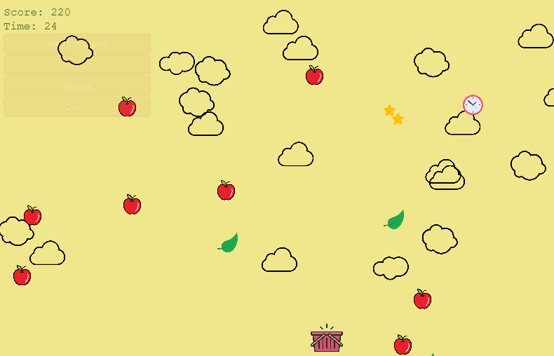

# Fruit Catcher Arcade Game

## Description

Fruit Catcher is a fun project that implements a very simple arcade game using JavaFX and Java. The game demonstrates basic arcade-style gameplay and serves as a lightweight example of using JavaFX for interactive applications. Whether you’re looking to learn JavaFX or simply enjoy a small, self-contained game, Fruit Catcher is a great starting point.



## Features

- Simple arcade gameplay using JavaFX
- Demonstrates basic game loop and user interaction
- Easy to understand and modify codebase
- Built with Java and Maven

## Requirements

- **Java:** Version 11 or later is recommended.
- **JavaFX SDK:** Download from [OpenJFX](https://openjfx.io/).
- **Maven:** For building the project.

## Setup and Running

### Running in an IDE

1. **Clone the Repository:**
   ```bash
   git clone https://github.com/jkarcsi/fruit-catcher.git
   ```
2. **Open the Project:**  
   Import the project into your favorite IDE (e.g., IntelliJ IDEA).

3. **Configure VM Options for JavaFX:**  
   Add the following VM options to your run configuration (adjust the path accordingly):
   ```
   --module-path /path/to/javafx/lib --add-modules javafx.controls,javafx.fxml,javafx.media
   ```
4. **Optional:**  
   You can copy the provided `runGame.xml` into your `.idea/runConfigurations` folder to use a preconfigured run configuration.

### Building and Running from the Console

1. **Build the Project with Maven:**
   ```bash
   mvn clean package
   ```
2. **Run the Game:**
   ```bash
   java -jar target/fruit-catcher-<version>.jar
   ```
   *If needed, include the JavaFX VM options:*
   ```bash
   java --module-path /path/to/javafx/lib --add-modules javafx.controls,javafx.fxml,javafx.media -jar target/fruit-catcher-<version>.jar
   ```

## Customization and Further Development

- The game’s source code is located in the `src` directory, frontend scenes are in `resources/view/scene`.
- Feel free to modify the gameplay logic, add new features, or improve the user interface.
- Contributions, bug reports, and suggestions are welcome!
- Note it is a fun and educational project developed to explore JavaFX capabilities and simple game design. 

_Enjoy playing around with the code and happy coding!_

## License

This project is released under the [MIT License](LICENSE).

## Contact
For questions or support, please contact:
**Karoly Jugovits** – [jugovitskaroly@gmail.com](mailto:jugovitskaroly@gmail.com)
